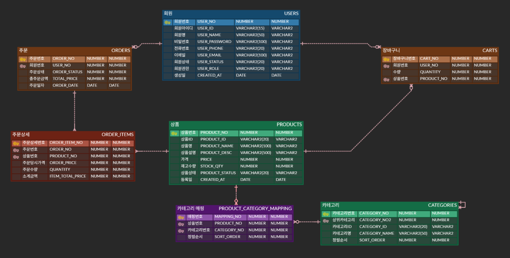
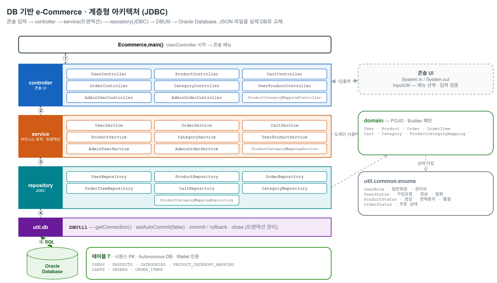
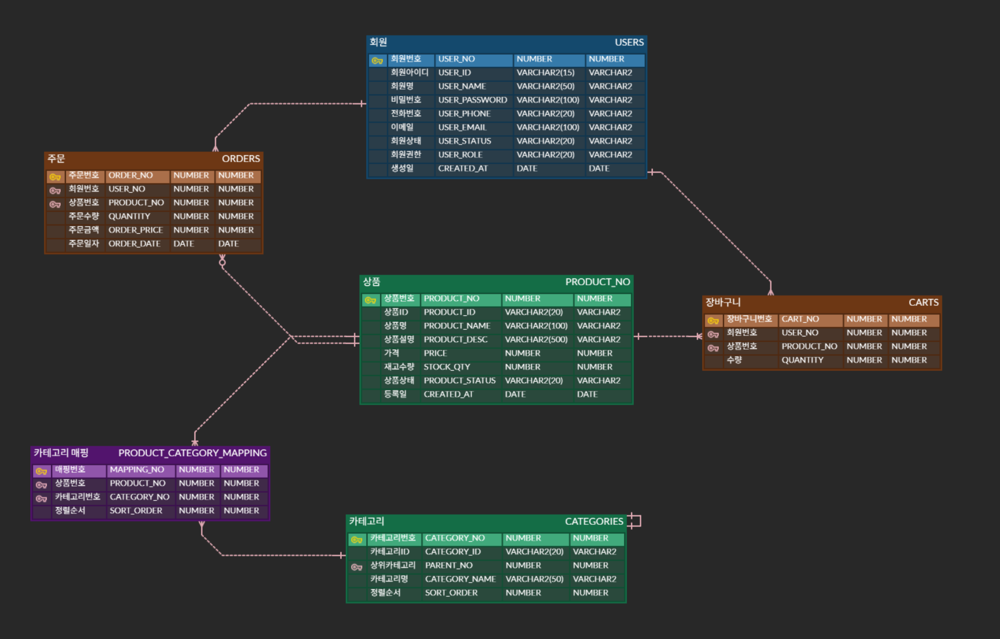
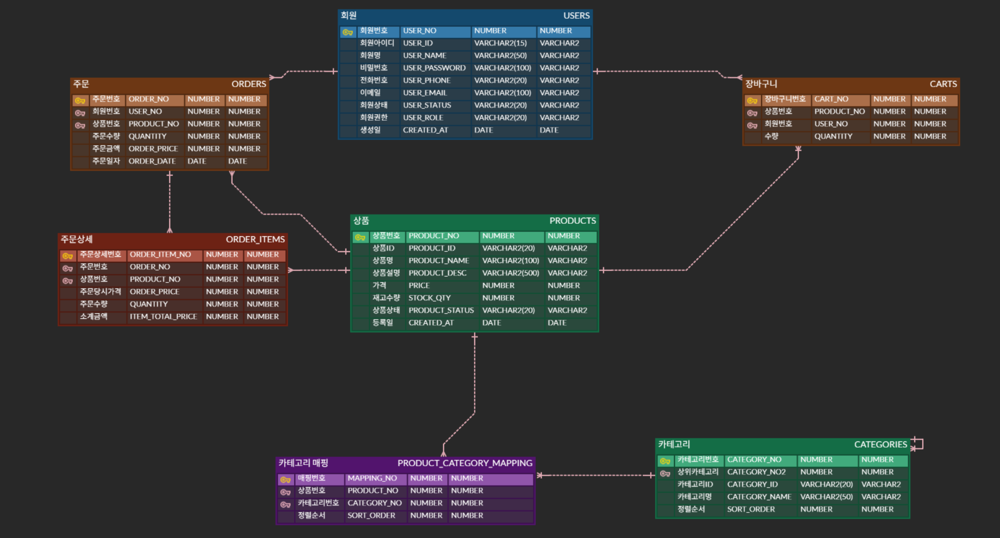
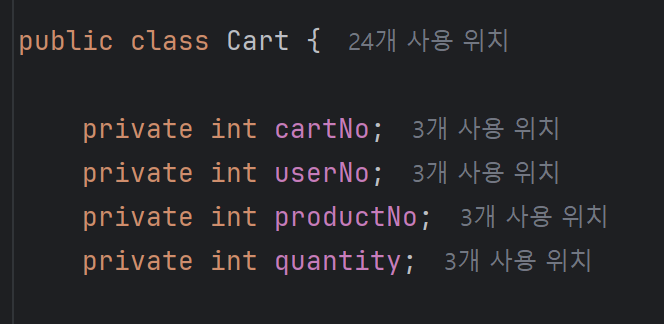
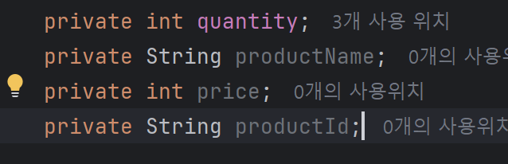

# DB 기반 e-Commerce (JDBC · Oracle)

1단계에서 JSON 파일로 데이터를 저장하던 콘솔 쇼핑몰을, Oracle Database와 JDBC로 옮긴 2단계입니다. 화면과 기능은 1단계와 같고, 데이터를 파일이 아니라 실제 DB에서 읽고 씁니다. `controller / service / repository` 계층 구조는 그대로 두고 repository 내부 구현만 JSON에서 JDBC로 바꿨습니다.

이 과제도 1단계와 마찬가지로 LLM 도움 없이 직접 작성했습니다. 2026년 4월 16일부터 19일까지 작업했고, 중간에 교수님이 JOIN과 트랜잭션을 직접 써보라고 하셔서 단순 반복 조회를 JOIN으로 정리하고 쓰기 작업에 트랜잭션을 적용했습니다.

## 프로젝트 정보

| | |
|:--|:--|
| 개발 기간 | 2026.04.16 ~ 04.19 |
| 인원 | 1명 |
| 유형 | JSON → JDBC 리팩터링 과제 |
| 소속 | 한국폴리텍대학 광명융합기술교육원 데이터분석과 |
| 작성자 | 이상혁 |

## 1단계에서 달라진 점

1단계는 작업 시간이 하루뿐이라 `findAll`로 JSON 파일을 통째로 읽어 메모리에서 거르는 방식을 많이 썼습니다. 데이터가 늘면 비효율적이라는 걸 작업하면서 느꼈고, 2단계에서는 필요한 데이터만 SQL로 조회하도록 바꾸는 데 신경 썼습니다.

- 저장소: JSON 파일 → Oracle Database
- 조회: 전체를 읽어 메모리에서 필터 → SQL로 필요한 행만 조회
- 데이터 접근: Jackson 직렬화 → JDBC(`PreparedStatement`, `ResultSet`)
- 계층 구조(controller / service / repository)와 콘솔 UI는 그대로 유지

## 사용 기술

- Java 21, Gradle
- JDBC
- Oracle Database (Autonomous Database, Wallet 인증)
- ojdbc11 (Oracle JDBC 드라이버) / oraclepki · osdt_core · osdt_cert (Wallet 보안 접속)

## 데이터베이스 설계

테이블 7개로 구성했습니다. 전체 스키마와 초기 데이터는 [이상혁DB파일.sql](java_final_eCommerce_이상혁/이상혁DB파일.sql)에 있습니다.

`USERS` · `PRODUCTS` · `CATEGORIES` · `PRODUCT_CATEGORY_MAPPING` · `CARTS` · `ORDERS` · `ORDER_ITEMS`

- 주문은 `ORDERS`(주문 공통 정보)와 `ORDER_ITEMS`(주문 상세)로 1:N 분리했습니다. 한 주문에 여러 상품이 담기는데 한 테이블에 합치면 주문 정보가 상품 수만큼 중복되기 때문입니다.
- 카테고리는 `PARENT_NO`로 대분류·중분류를 자기참조로 표현했습니다.
- 기본키는 시퀀스(`SEQ_*`)로 채번합니다.



전체 ERD는 [erdcloud](https://www.erdcloud.com/d/cL5oD5pskmoMnm5K7)에서도 볼 수 있습니다.

시간이 부족해 테이블에 외래키와 제약조건은 걸지 못했습니다. 대신 상태값을 자바 enum(`UserStatus`, `ProductStatus`, `OrderStatus`)으로 관리해 무결성을 일부 보완했고, 외래키 추가는 다음 개선 과제로 남겨 뒀습니다.

## 리팩터링하면서 신경 쓴 점

### 트랜잭션 관리

쓰기 작업은 service 계층에서 트랜잭션을 직접 관리합니다. 커넥션을 받아 `setAutoCommit(false)`로 시작하고, 정상 처리되면 `commit()`, 예외가 나면 `rollback()`, 마지막에 `finally`에서 커넥션을 닫습니다.

```java
Connection con = null;
try {
    con = DBUtil.getConnection();
    con.setAutoCommit(false);     // 트랜잭션 시작

    // ... repository 호출 (등록 / 수정 / 삭제)

    con.commit();                 // 성공 시 커밋
} catch (Exception e) {
    DBUtil.rollback(con);         // 실패 시 롤백
    throw new RuntimeException("처리 실패", e);
} finally {
    DBUtil.close(con);            // 자원 정리
}
```

단순 조회는 트랜잭션이 필요 없어서 `try-with-resources`로 커넥션만 자동으로 닫습니다.

```java
try (Connection con = DBUtil.getConnection()) {
    List<Order> orders = orderRepository.findAllWithUser(con);
    // ...
}
```

### N+1 조회 줄이기 (JOIN)

처음에는 목록을 가져온 뒤 항목마다 다시 단건 조회를 돌렸습니다. 장바구니를 예로 들면, 장바구니 행을 읽은 다음 상품 정보를 얻으려고 상품마다 `findByProductNo`를 또 호출했습니다. 항목이 N개면 쿼리가 `1 + N`번 나가는 N+1 문제라, JOIN으로 한 번에 가져오도록 바꿨습니다.

```java
// 변경 전: 장바구니가 N개면 상품 조회가 N번 더 발생
List<Cart> carts = cartRepository.findByUserNo(con, userNo);
for (Cart cart : carts) {
    Product product = productRepository.findByProductNo(con, cart.getProductNo());
    ...
}

// 변경 후: JOIN으로 한 번에 조회
List<Cart> carts = cartRepository.findWithProductByUserNo(con, userNo);
for (Cart cart : carts) {
    int itemTotal = cart.getPrice() * cart.getQuantity();  // 상품 정보가 이미 들어 있음
    ...
}
```

```sql
SELECT C.CART_NO, C.USER_NO, C.PRODUCT_NO, C.QUANTITY,
       P.PRODUCT_ID, P.PRODUCT_NAME, P.PRICE
FROM CARTS C
JOIN PRODUCTS P ON C.PRODUCT_NO = P.PRODUCT_NO
WHERE C.USER_NO = ?
ORDER BY C.CART_NO
```

같은 방식으로 정리한 곳입니다.

- 장바구니 조회 — `CartRepository.findWithProductByUserNo` (CARTS + PRODUCTS)
- 카테고리별 상품 — `ProductRepository.findByCategoryNo` (PRODUCTS + PRODUCT_CATEGORY_MAPPING)
- 관리자 주문 목록·상세 — `OrderRepository.findAllWithUser` / `findDetailWithUserByOrderNo`, `OrderItemRepository.findWithProductByOrderNo`
- 상품-카테고리 매핑 목록 — `ProductCategoryMappingRepository.findAllWithNames`

### 존재 확인은 서브쿼리(EXISTS)

하위 카테고리가 있는지, 매핑이 이미 있는지처럼 "있다 / 없다"만 확인하면 되는 경우, 처음에는 `COUNT(*)`로 전체 개수를 센 뒤 0보다 큰지 비교했습니다. 개수가 필요한 게 아니라 한 건만 있으면 되는 것이라, 첫 행에서 멈추는 `EXISTS`로 바꿨습니다.

```sql
-- 변경 전: 전체 개수를 센다
SELECT COUNT(*) FROM CATEGORIES WHERE PARENT_NO = ?

-- 변경 후: 한 건이라도 있으면 멈춘다
SELECT 1 FROM DUAL
WHERE EXISTS (SELECT 1 FROM CATEGORIES WHERE PARENT_NO = ?)
```

`CategoryRepository.hasChildren`, `ProductCategoryMappingRepository.existsMapping`에 적용했습니다.

### Builder 패턴

도메인 객체에 생성자가 여러 개로 늘어나면서 인자 순서를 맞추기 번거롭고 가독성도 떨어졌습니다. 그래서 객체 생성을 Builder로 바꿔, 어떤 값이 들어가는지 한눈에 보이도록 했습니다.

```java
User newUser = User.builder()
        .userId(userId)
        .userName(userName)
        .userPassword(userPassword)
        .userPhoneNumber(phoneNumber)
        .userEmail(email)
        .userStatus(UserStatus.가입요청)
        .userRole(UserRole.일반회원)
        .build();
```

### PreparedStatement

모든 쿼리는 `PreparedStatement`로 파라미터를 바인딩해 SQL 인젝션을 막았습니다.

## 실행 방법

1. Oracle DB에 [이상혁DB파일.sql](java_final_eCommerce_이상혁/이상혁DB파일.sql)을 실행해 테이블·시퀀스·초기 데이터를 만듭니다.
2. 아래 환경변수 4개를 본인 환경값으로 설정합니다.
   - `DB_URL` — 접속 URL (예: `jdbc:oracle:thin:@본인TNS별칭`)
   - `DB_USER` — DB 계정
   - `DB_PASSWORD` — DB 비밀번호
   - `TNS_ADMIN` — Oracle Wallet 폴더 경로
3. 실행 클래스는 `Ecommerce`입니다.
4. 관리자 로그인은 아이디 `admin`, 비밀번호 `1234`입니다. 일반회원은 회원가입 후 관리자가 승인하면 로그인됩니다.

JDK 21 / Gradle 환경에서 동작하며, 최초 빌드 때 Oracle JDBC 드라이버를 내려받습니다.

## 폴더 구조

```
kr.co.javaex.sec23
├─ Ecommerce.java   실행 진입점
├─ controller       콘솔 메뉴 / 입력 처리
├─ service          비즈니스 로직 + 트랜잭션 관리
├─ repository       JDBC (PreparedStatement, ResultSet → 객체 매핑)
├─ domain           데이터 클래스 (Builder)
└─ util
   ├─ db.DBUtil     커넥션 생성 / 커밋·롤백·종료
   ├─ common.InputUtil
   └─ common.enums  상태값 (User / Product / Order)
```

계층 구조와 데이터 흐름을 다이어그램으로 정리했습니다.



## 앞으로 (3단계)

다음은 Spring Boot로 옮깁니다. 지금 직접 짠 JDBC 코드를 JPA·MyBatis로 대체하고, 로그인과 권한은 Spring Security로 처리할 계획입니다. `controller / service / repository` 구조가 스프링과 거의 같아 옮기는 부담은 크지 않을 것으로 보고 있습니다.

## 설계 과정 (작업 기록)

리팩터링하면서 노션에 과정을 기록해 뒀습니다. (PDF 백업: [노션 링크 안되면.pdf](java_final_eCommerce_이상혁/노션%20링크%20안되면.pdf))

<details>
<summary>ERD를 잡아 간 과정</summary>

먼저 JSON 데이터를 기준으로 모든 테이블에 식별자(번호)를 부여했고,



한 주문에 여러 상품이 들어가는 문제 때문에 주문/주문상세를 1:N로 분리해 최종 ERD를 정리했습니다.



</details>

<details>
<summary>장바구니 N+1 — JOIN을 위해 Cart에 필드 추가</summary>

장바구니 조회를 JOIN 한 번으로 바꾸면서, 상품을 다시 조회하지 않도록 Cart에 상품명·가격·상품ID 세 필드를 더했습니다.





</details>
