# SANG GALLERY — Spring Boot e-Commerce

사진 작품을 사고파는 갤러리형 e-Commerce 플랫폼입니다. 회원 인증/권한, 상품 탐색(검색·페이징), 장바구니, 주문, 관리자 운영 기능을 Spring Boot(MVC)로 구현했습니다. KOPO 자바 과정의 1·2단계(JSON → JDBC)에서 이어지는 3단계로, 같은 e-Commerce 도메인을 실무에 가까운 스택으로 다시 설계했습니다.

기능을 많이 만드는 것보다 **"어디에 어떤 기술을 왜 적용했는지"** 를 설명할 수 있도록 계층과 책임을 나눠 구현하는 데 집중했습니다.

**바로가기** · [아키텍처](#아키텍처) · [데이터베이스 설계](#데이터베이스-설계) · [주요 기능](#주요-기능) · [문제 해결](#문제-해결--설계-판단) · [실행 방법](#실행-방법) · [LLM 사용 범위](#llm-사용-범위-정직하게-명시)

## 프로젝트 정보

| | |
|:--|:--|
| 개발 기간 | 2026.05.11 ~ 05.17 |
| 인원 | 1명 (시험) |
| 유형 | 학습 기반 포트폴리오 (Spring Boot e-Commerce) |
| 소속 | 한국폴리텍대학 광명융합기술교육원 데이터분석과 |
| 작성자 | 이상혁 |
| 담당 | 기획 · DB 설계 · 백엔드 · 프론트(Thymeleaf) · 환경 구성 |

## 사용 기술

- **Backend** — Java 21, Spring Boot / Spring MVC, Validation
- **Data Access** — Oracle Database (ojdbc11 · HikariCP), **JPA**(도메인·트랜잭션), **MyBatis**(목록·검색·페이징 조회)
- **인증 / 예외** — Session 기반 인증·인가, BCrypt 비밀번호 해시, `@ControllerAdvice` 예외 중앙화
- **View** — Thymeleaf (서버 사이드 렌더링)
- **최적화** — Spring Cache(카테고리 조회), 이미지 WEBP 변환

## 아키텍처

요청은 인터셉터(로그인 / 관리자 권한)를 거쳐 컨트롤러로 들어오고, 서비스가 비즈니스 규칙과 트랜잭션을 맡습니다. 데이터 접근은 **JPA와 MyBatis를 역할에 따라 나눠** 썼습니다.

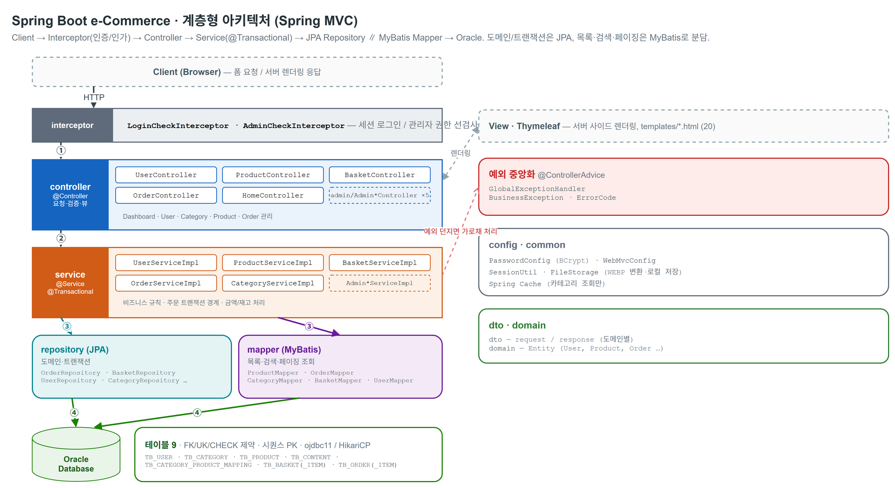

- **계층을 나눈 이유** — 컨트롤러는 요청·검증·뷰에, 서비스는 비즈니스 규칙·트랜잭션에 집중하도록 책임을 분리했습니다. 기능이 늘어도 변경이 한곳에 몰리지 않게 하려는 의도입니다.
- **JPA와 MyBatis를 같이 쓴 이유** — 일관성이 중요한 도메인(주문)은 JPA로 트랜잭션 중심으로 처리하고, 화면 요구가 다양한 조회(상품 목록·검색·페이징)는 MyBatis로 SQL을 명시적으로 다뤘습니다.

## 데이터베이스 설계

테이블 9개로 구성했고 FK·UK·CHECK 제약을 적용했습니다. 전체 DDL은 [Oracle.sql](ecommerce-springboot/docs/ddl/Oracle.sql)에 있습니다.

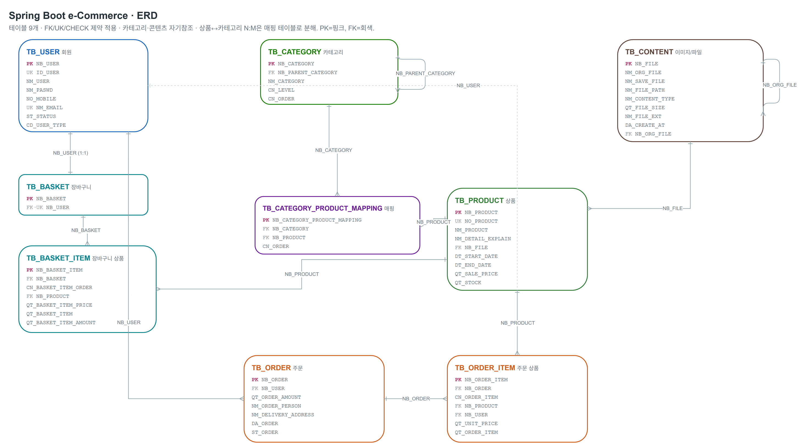

- 주문은 `TB_ORDER`(주문 공통 정보)와 `TB_ORDER_ITEM`(주문 상세)으로 1:N 분리했습니다 — 한 주문에 상품이 여러 개 들어가기 때문입니다.
- 상품↔카테고리는 N:M이라 `TB_CATEGORY_PRODUCT_MAPPING` 매핑 테이블로 분해했습니다.
- 카테고리는 `NB_PARENT_CATEGORY` 자기참조로 대·중분류를 표현하고, 이미지는 `TB_CONTENT`로 분리(원본·WEBP 확장을 고려)했습니다.
- 상태값은 코드(`ST01~`, `OR01~`)로, 권한은 `CD_USER_TYPE`(10 일반 / 20 관리자)로 관리합니다.

## 주요 기능

### 메인 — 로그인 분기
로그인 여부에 따라 진입 동작과 메뉴를 분기하고, 최신 상품을 보여줍니다.


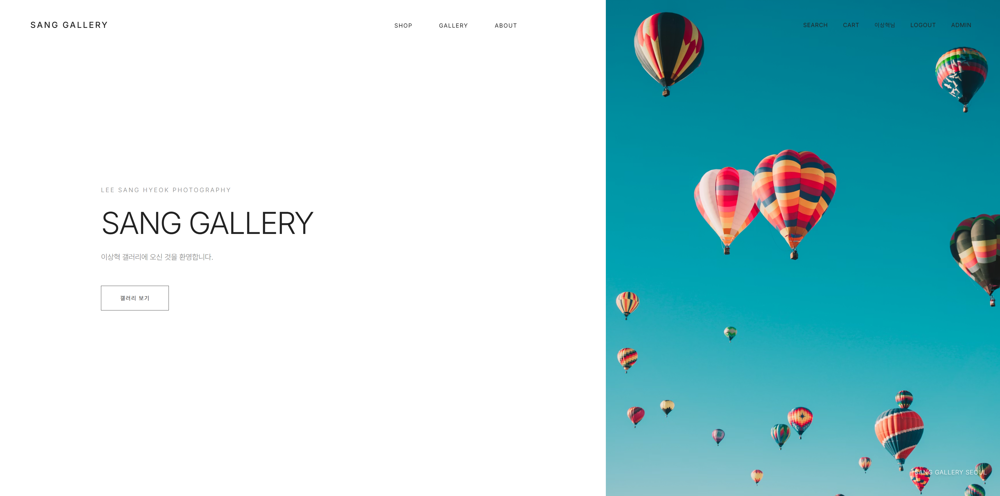

### 회원 — 세션 인증 + BCrypt + 예외 중앙화
세션으로 로그인 상태를 관리하고 비밀번호는 BCrypt로 해시 저장합니다. 인증 실패·계정 미존재 같은 예외는 `@ControllerAdvice`에서 일관된 메시지로 처리해, 컨트롤러마다 예외 처리가 흩어지지 않게 했습니다.


### 상품 — 검색 / 페이징 + 선택적 캐시
MyBatis로 카테고리·검색·페이징 조회를 처리합니다. 변경이 드문 카테고리 조회에만 Spring Cache를 적용하고, 최신성이 중요한 상품·재고는 캐시에서 제외했습니다.

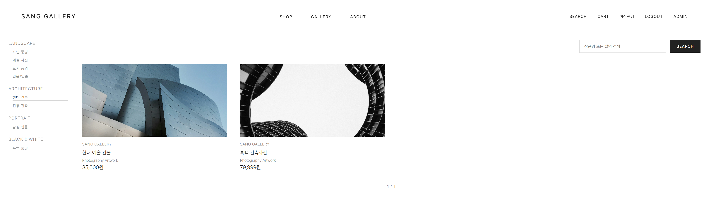
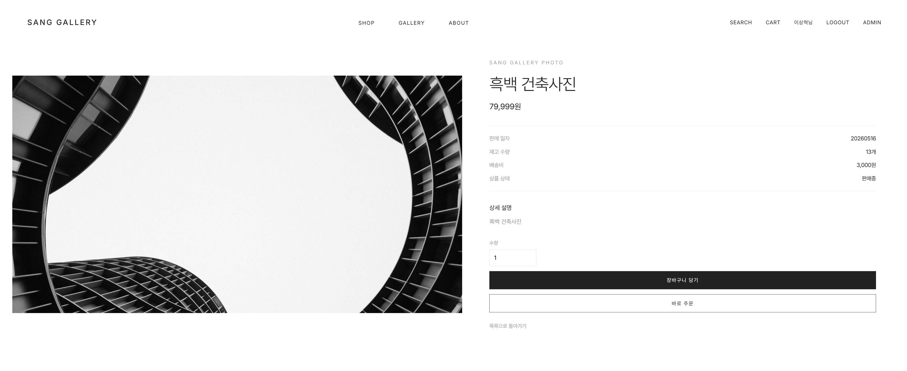

### 장바구니 · 주문 — 트랜잭션 경계
장바구니 담기·수량 변경·삭제·비우기와, 장바구니 전체/선택 주문 및 바로 주문을 지원합니다. 주문 생성은 금액·수량·재고 처리가 중간에 깨지지 않도록 트랜잭션으로 묶었습니다.

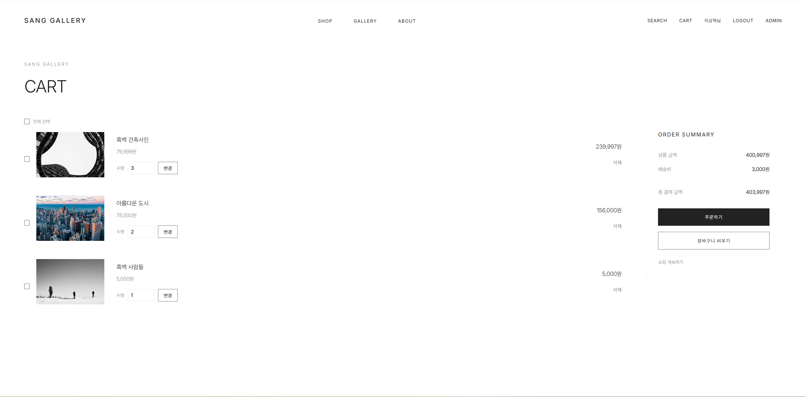

### 마이페이지 · 주문 내역
주문 목록·상세와 회원 정보를 조회·관리합니다.

<details>
<summary>마이페이지 · 주문 내역 화면 보기</summary>

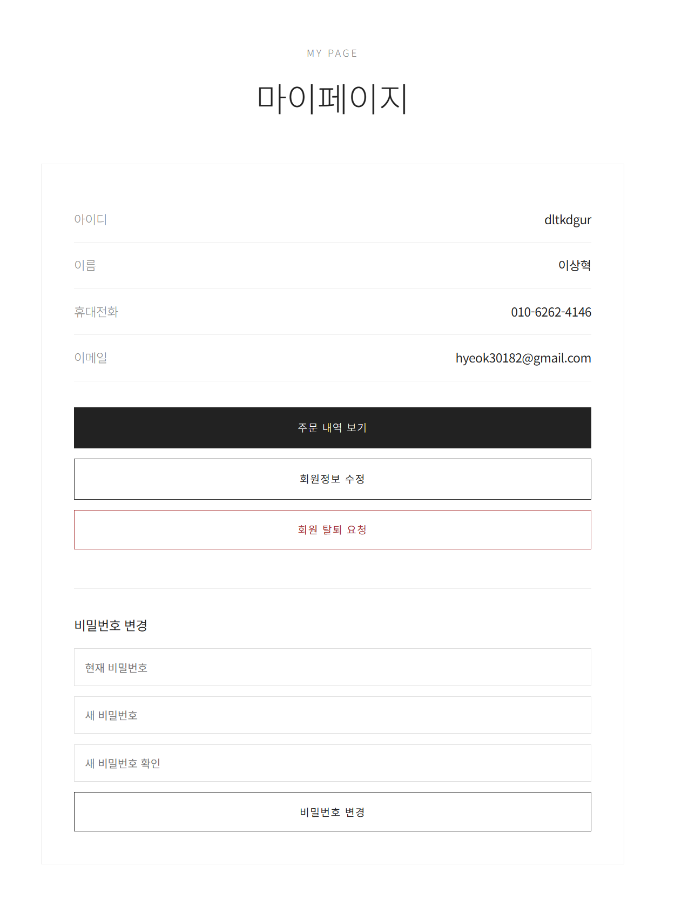
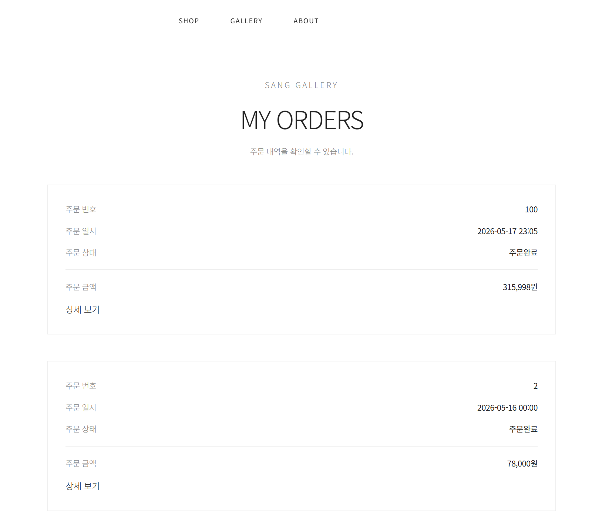
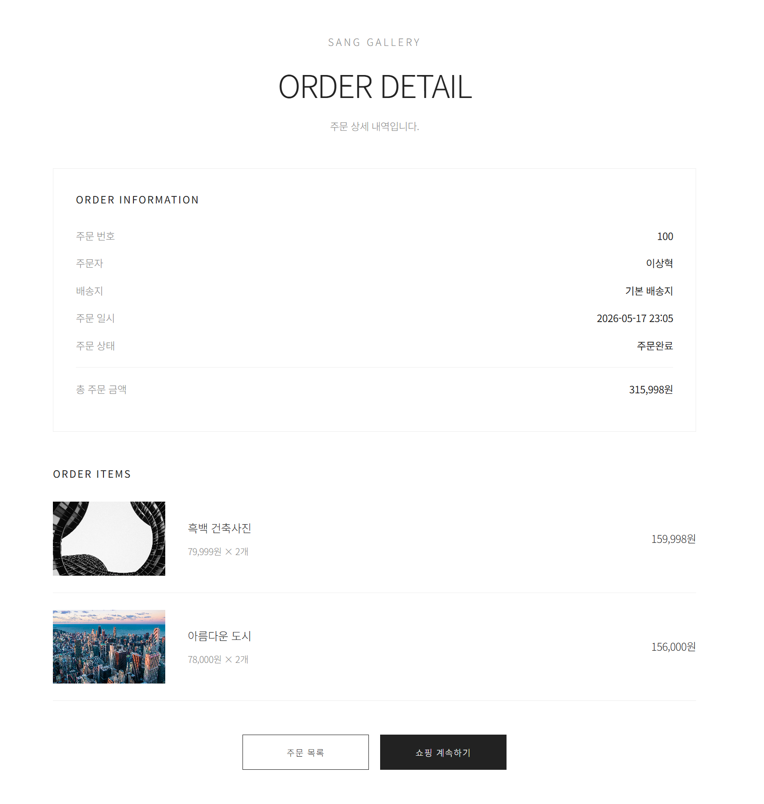

</details>

### 관리자 — 권한 분리
관리자 기능은 인터셉터로 접근을 제한합니다. 회원·카테고리·상품·주문을 관리하고 주문 상태를 변경합니다.

<details>
<summary>관리자 화면 5컷 보기 (대시보드 · 회원 · 카테고리 · 주문 상태 · 상품 운영)</summary>

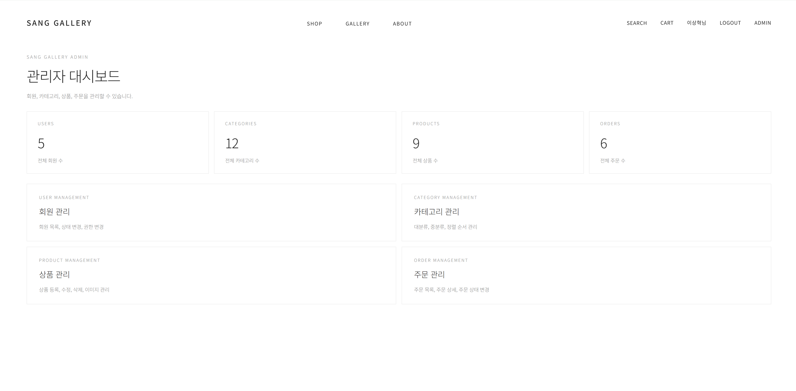
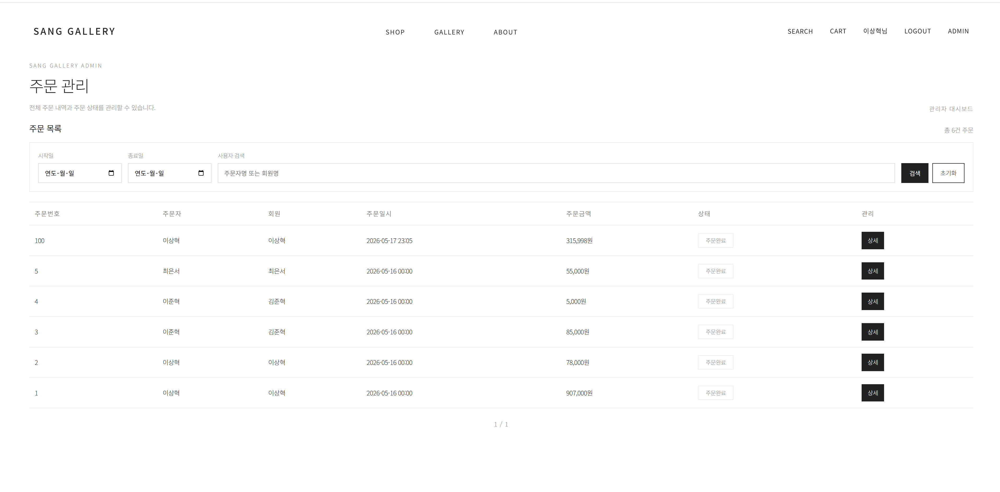
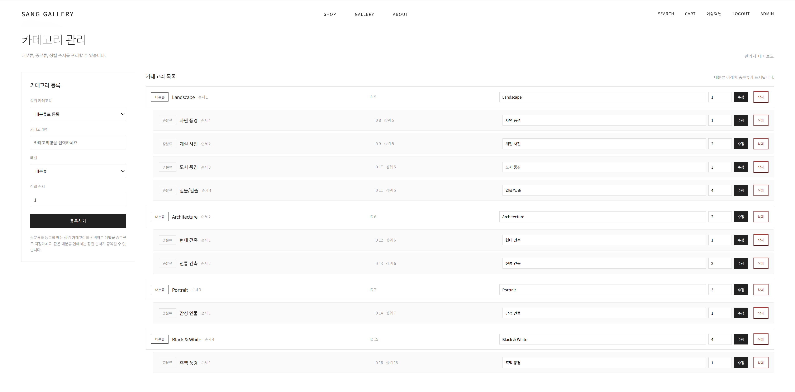
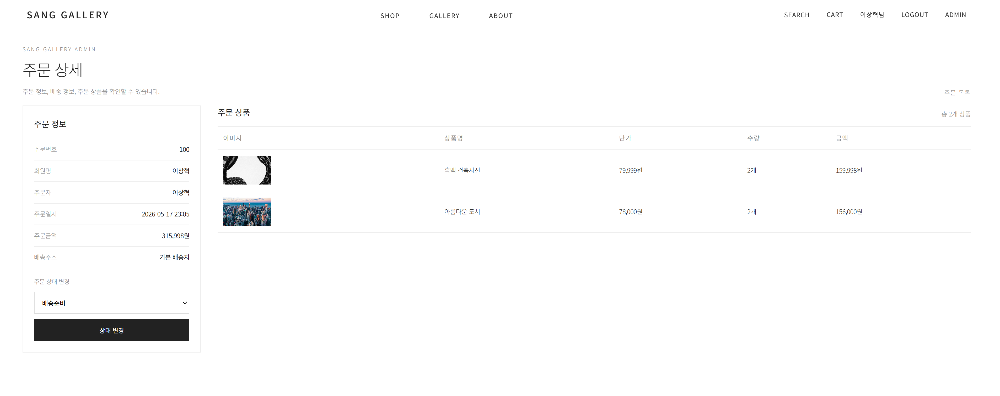
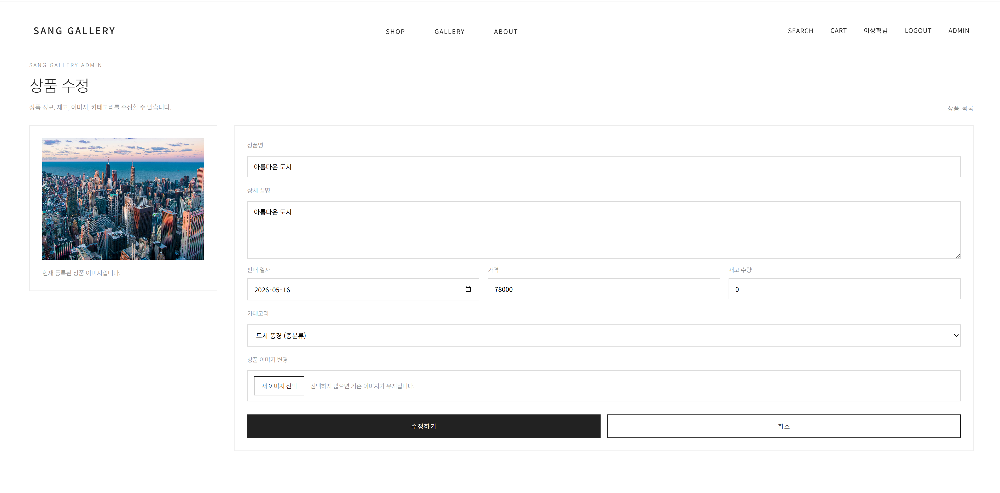

</details>

## 문제 해결 / 설계 판단

- **예외를 중앙화한 이유** — 컨트롤러마다 try/catch가 늘면 중복·누락이 생겨서, `@ControllerAdvice` + `BusinessException` / `ErrorCode`로 메시지 정책을 한곳에서 관리했습니다.
- **JPA + MyBatis 병행** — 트랜잭션 일관성이 중요한 영역은 JPA로 묶고, 화면 요구가 많은 조회는 MyBatis로 SQL을 직접 제어했습니다.
- **캐시를 일부에만** — 카테고리는 변경이 드물어 캐시 이점이 크지만, 상품·재고는 최신성이 중요해 제외했습니다. "적용 여부"보다 "적용 범위"를 정하는 게 중요하다고 봤습니다.

## 실행 방법

1. Oracle DB에 [Oracle.sql](ecommerce-springboot/docs/ddl/Oracle.sql)을 실행해 테이블·제약·시드 데이터를 만듭니다.
2. `ecommerce-springboot/src/main/resources/application.properties`의 DB 접속 정보(`<DB_USER>` / `<DB_PASSWORD>`)를 본인 환경값으로 채웁니다.
3. `./gradlew bootRun` (JDK 21). 기본 포트는 `8080`입니다.
4. 관리자 계정은 보안상 공개하지 않습니다 — 시드의 `admin` 계정 비밀번호 해시를 본인 BCrypt 해시로 교체하거나, 회원의 `CD_USER_TYPE`을 `20`(관리자)으로 직접 바꿔 사용하세요.

## LLM 사용 범위 (정직하게 명시)

이 과제도 LLM 미사용이 원칙이었고 기능 설계·구현은 직접 했습니다. 다만 아래 부분은 LLM(ChatGPT)을 사용했고, 숨기지 않고 그대로 밝힙니다.

- **디버깅 보조** — ① 회원가입이 처리되지 않던 문제(원인: Request DTO에 Setter 누락 → `@ModelAttribute` 바인딩 실패) ② Bean Validation에서 인터페이스/구현체 어노테이션 일치 규칙 확인 ③ Oracle `ORA-01552`(클라우드 계정 저장공간 초과) 원인 분석 ④ 클라우드 → 로컬 이전 시 `ALTER` 구문 추출·정렬
- **프론트엔드(교수님 허용 범위)** — 최종 테이블 명세가 바뀌면서 로그인·회원가입·메인·카테고리 **4개 페이지의 HTML/Thymeleaf**를 ResponseDto 구조에 맞게 수정할 때만 사용했습니다. 이 4개 페이지 외의 모든 기능 구현은 직접 작성했습니다.
- UI는 일러스트로 와이어프레임을 직접 잡은 뒤 디자이너 친구의 피드백을 받았고, Dribbble·Behance를 참고했습니다.

## 폴더 구조

```
03-springboot-ecommerce/
├─ ecommerce-springboot/        # Spring Boot 프로젝트
│  ├─ src/main/java/kr/co/shop
│  │  ├─ controller (+ admin)   # @Controller · 요청/검증/뷰
│  │  ├─ service                # @Service · 비즈니스/트랜잭션
│  │  ├─ repository/jpa         # Spring Data JPA
│  │  ├─ domain                 # Entity
│  │  ├─ dto                    # request / response
│  │  ├─ config                 # PasswordConfig(BCrypt), WebMvcConfig
│  │  └─ common                 # 예외 · 인터셉터 · 파일 · 세션 · enum
│  └─ src/main/resources
│     ├─ mapper/*.xml           # MyBatis
│     ├─ templates/*.html       # Thymeleaf
│     └─ static                 # css / js / img
└─ docs
   ├─ diagrams                  # 아키텍처 · ERD
   └─ screenshots
```

## 개선 예정

- 장바구니 금액·수량 변경 AJAX 비동기화
- 캐시 TTL / 무효화 정책 정리
- Spring Security 전환 및 테스트 코드 확충
