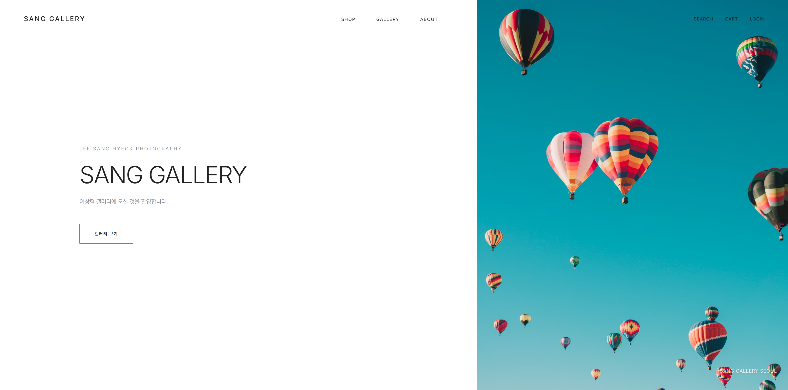

# Java e-Commerce 발전 과정 — JSON → JDBC → Spring Boot

한국폴리텍대학 광명융합기술교육원 데이터분석과 과제에서 출발해, **같은 e-Commerce 도메인을 세 단계로 발전**시키며 정리한 모노레포입니다. 파일 기반 콘솔에서 시작해 JDBC로, 다시 Spring Boot 웹 애플리케이션까지 같은 쇼핑몰을 다시 설계했습니다.



<sub>3단계 결과물 — SANG GALLERY (Spring Boot 웹 e-Commerce)</sub>

## 단계별 발전

| 단계 | 프로젝트 | 핵심 내용 | 바로가기 |
|:--:|:--|:--|:--:|
| **1** | 파일 기반 콘솔 쇼핑몰 | Java 21 · JSON(Jackson) 저장 · controller / service / repository 계층 | [살펴보기 →](01-java-json-ecommerce/README.md) |
| **2** | JDBC 리팩터링 (DB 이전) | JDBC · Oracle · 트랜잭션 · N+1을 JOIN으로 · Builder | [살펴보기 →](02-java-jdbc-ecommerce/README.md) |
| **3** | Spring Boot 웹 애플리케이션 | Spring MVC · JPA + MyBatis · Thymeleaf · 세션 인증 · 관리자 | [살펴보기 →](03-springboot-ecommerce/README.md) |

```text
1. JSON 파일 (콘솔)  →  2. JDBC + Oracle (콘솔)  →  3. Spring Boot · JPA+MyBatis (웹)
```

같은 도메인을 다시 만들며 **저장 방식과 구조가 어떻게 발전했는지**를 보여주는 것이 이 저장소의 목적입니다. 각 단계의 설계 의도, 다이어그램(아키텍처·ERD), 실행 화면은 단계별 README에 정리해 두었습니다.

## 기술

`Java 21` · `Spring Boot` · `Spring MVC` · `JPA` · `MyBatis` · `JDBC` · `Oracle` · `Thymeleaf` · `Gradle`

## 작성자

- 이상혁 · [SanghyeokLee-KR](https://github.com/SanghyeokLee-KR)
- 한국폴리텍대학 광명융합기술교육원 데이터분석과
